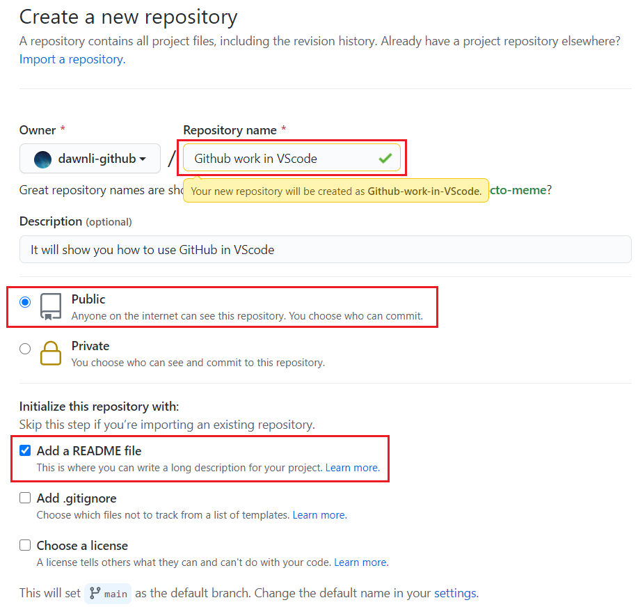
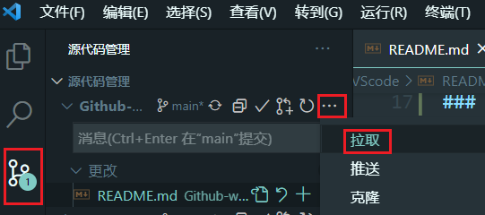
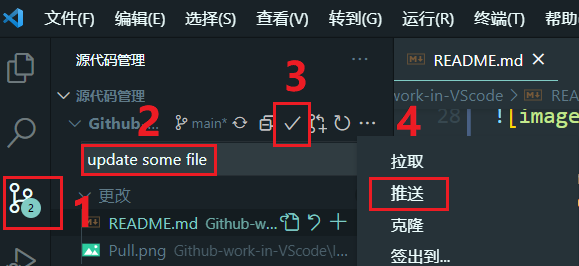

# Github-work-in-VScode

It will show you how to use GitHub in VScode. 

## 1. Create a repository and init it



## 2. Setting config in VScode terminal

```shell
git config --global user.name "your github name" 
git config --global user.email "your github email"
```

## 3. Clone(Pull) repository
### Clone

* Open VScode in your work folder and use its terminal

```shell
git clone  https://github.com/*****.git
cd "your repository"
```

### Pull



## 4. Push your change to Github

* When you finish your code edit or do some other changes have been made to the project, you can pushh your change to Github in this way. 


